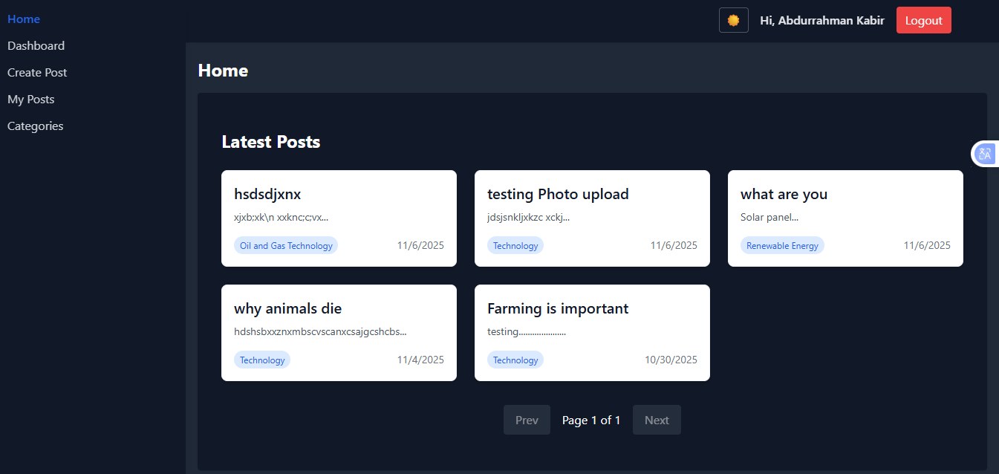
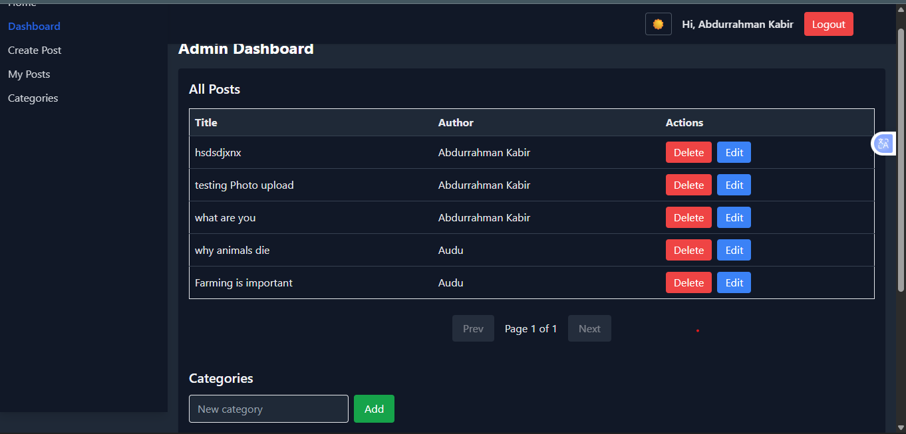
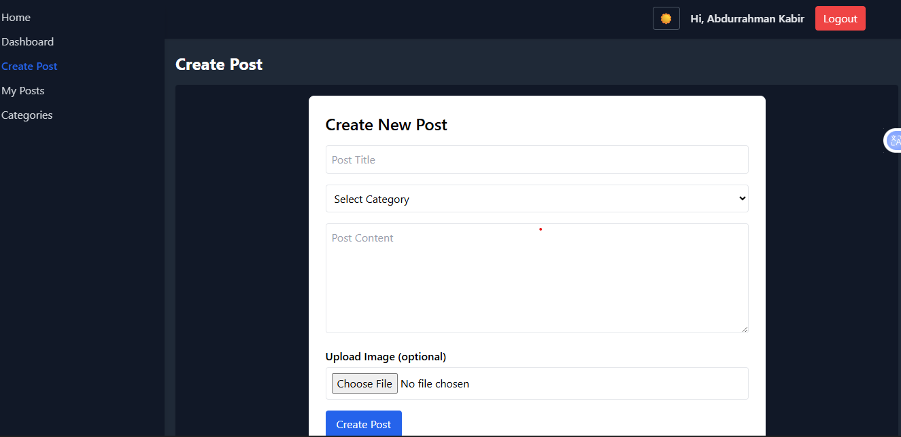

# 📰 MERN Blog Application

A full-stack MERN (MongoDB, Express, React, Node.js) blog platform that allows users to view and read posts, while administrators can create, edit, and delete posts and categories.

---

## 🚀 Project Overview

This project is a **Blog Management System** built using the MERN stack. It enables admin users to manage posts and categories, and public users to browse through paginated blog posts. It demonstrates complete frontend-backend integration with image uploads using **Cloudinary**, CRUD operations, and pagination.

---

## ⚙️ Setup Instructions

### 1. Clone the Repository
```bash
git clone <repository-url>
cd <project-folder>
```

### 2. Setup the Backend
```bash
cd server
npm install
```

#### Create a `.env` file with the following:
```
MONGO_URI=your_mongo_connection_string
CLOUDINARY_NAME=your_cloudinary_name
CLOUDINARY_API_KEY=your_cloudinary_api_key
CLOUDINARY_API_SECRET=your_cloudinary_api_secret
PORT=5000
```

#### Run the backend server:
```bash
npm start
```

### 3. Setup the Frontend
```bash
cd client
npm install
```

#### Create a `.env` file with:
```
VITE_API_URL=http://localhost:5000/api
```

#### Run the frontend:
```bash
npm run dev
```

---

## 🧩 Features Implemented

- Full CRUD operations for posts and categories
- Image upload via **Cloudinary**
- Responsive UI built with React and Tailwind CSS
- Admin and Public sections
- Paginated posts on the frontend
- Toast notifications for feedback
- Organized API structure with Express routes and controllers

---

## 📡 API Documentation

### 🔹 Categories

| Method | Endpoint          | Description               |
|--------|--------------------|---------------------------|
| GET    | `/api/categories` | Get all categories         |
| POST   | `/api/categories` | Create a new category      |
| PUT    | `/api/categories/:id` | Update a category     |
| DELETE | `/api/categories/:id` | Delete a category     |

### 🔹 Posts

| Method | Endpoint          | Description               |
|--------|--------------------|---------------------------|
| GET    | `/api/posts`      | Get all posts              |
| POST   | `/api/posts`      | Create a new post (with image) |
| GET    | `/api/posts/:id`  | Get post by ID             |
| PUT    | `/api/posts/:id`  | Update a post              |
| DELETE | `/api/posts/:id`  | Delete a post              |

---

## 🖼️ Screenshots

### Homepage (Public View)


### Admin Dashboard


### Post Creation Page


---

## 👨‍💻 Technologies Used

- **Frontend:** React, Axios, React Router, Tailwind CSS
- **Backend:** Node.js, Express.js, MongoDB, Mongoose
- **Cloud Services:** Cloudinary for image upload
- **Notifications:** React Hot Toast

---

## 🧠 Author

**Abdurrahman Kabir**  
📧 abdurrahmankabeer2003@gmail.com  
🔗 [GitHub](https://github.com/ABDURRAHMANKABEER)  
🔗 [LinkedIn](https://www.linkedin.com/in/abdurrahman-kabir-10580220b)

---

## 🏁 Conclusion

This MERN Blog Application demonstrates core full-stack development principles including API creation, database management, frontend integration, and image handling. It is a perfect reference project for understanding CRUD operations, Express routes, and frontend-backend communication.
